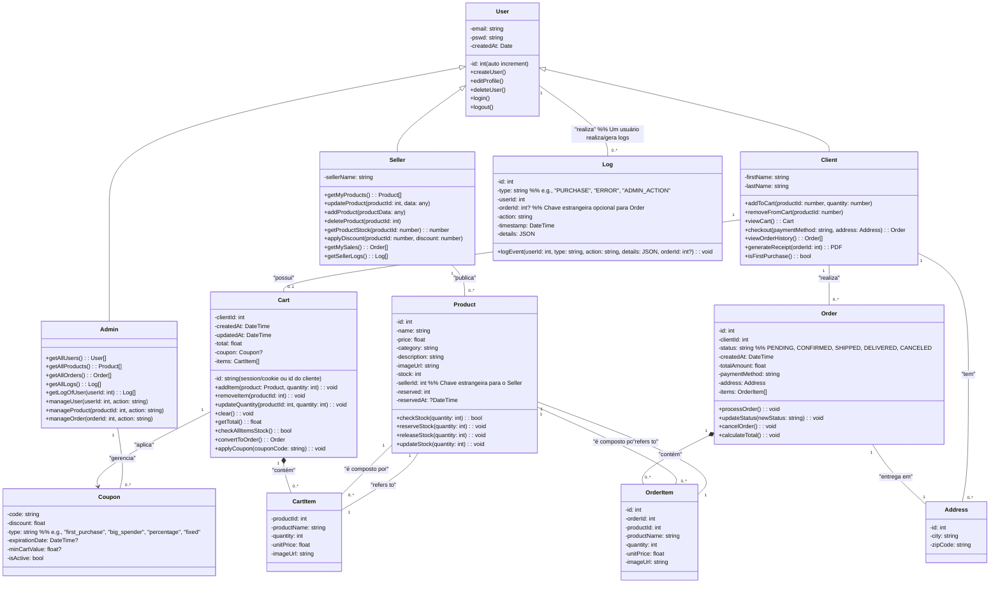
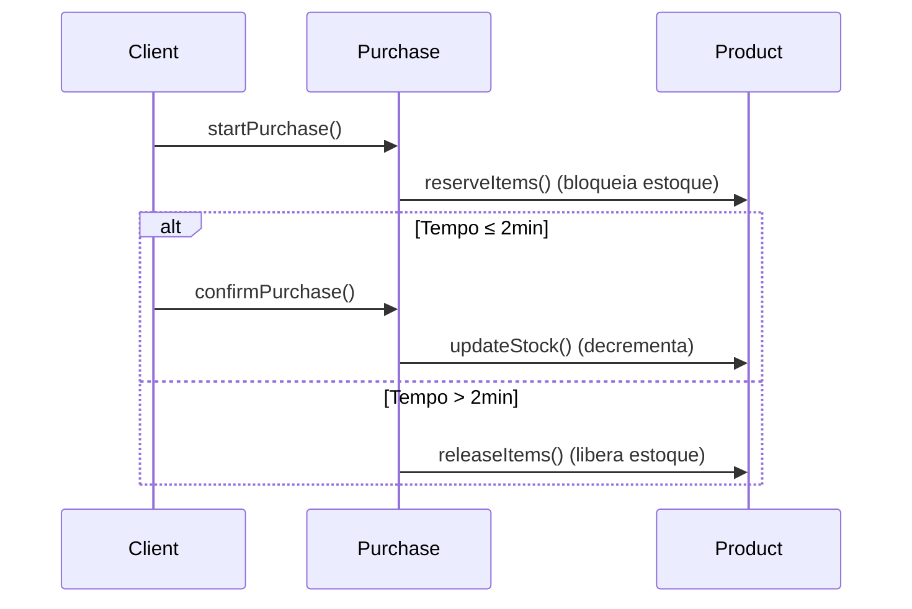

# Mercato

**Mercato** é um sistema simples e funcional de **compra e venda de produtos**, com controle de usuários, clientes e estoque. O projeto foi desenvolvido com foco em simplicidade, organização e boas práticas de desenvolvimento backend em **PHP puro**, utilizando **MySQL** como banco de dados e **Bootstrap** no frontend para uma interface responsiva.

[**Enunciado do projeto**](https://github.com/jacob-majesty/mercato/blob/main/ENUNCIADO_MERCATO.md)

Confira o diagrama UML do mercado para entender os fluxos e relações!

## Diagrama UML



## Fluxo de compra



## Funcionalidades

- Cadastro e gerenciamento de produtos
- Controle de estoque
- Venda de ingressos ou produtos
- Cadastro e gestão de clientes
- Controle de usuários do sistema (login e autenticação)
- Relatórios básicos de vendas

### Resumo Profissional - Controle de Acessos no Mercato

**Objetivo:**  
Implementar três perfis de usuário (Admin, Vendedor, Cliente) para garantir segurança, controle de acesso e aderência às regras de negócio.

**Benefícios-Chave:**

- **Controle de Acesso Granular**

  - Admins: Acesso total ao sistema
  - Vendedores: Gerenciam apenas seus produtos e clientes relacionados
  - Clientes: Acesso limitado ao próprio histórico de compras

# Instruções para rodar o projeto
0. **Clone o repositório**

```
git clone https://github.com/jacob-majesty/mercato.git
```

1. **Acesse a pasta do projeto**

```
cd mercato
```
2. **Executar com Docker** 

```bash
docker-compose up -d
```
3. **Instalação do Composer no Container**

**Objetivo:**  
Instalar o Composer exclusivamente dentro do container Docker para manter o ambiente de desenvolvimento isolado e consistente.

**Passos:**

a. Acesse o container:

   ```sh
   docker-compose exec <php_container_id> bash ou docker-compose exec <php_container_id> sh
   ```

b. instale as dependências:
   ```sh
   composer install
   ```
4. **Acesse o sistema no navegador**

```
http://localhost:80
```

### Teste do Sistema - Mercato

## Credenciais de acesso (Logar com credenciais)
- **Admin:** `admin@mercato.com` | Senha: `password123` (hash)
- **Vendedor:** `seller@mercato.com` | Senha: `password123` (hash)
- **Cliente:** `client@mercato.com` | Senha: `password123` (hash)

<!--
### Configurar o banco de dados

0. **Copie o arquivo** do host para o container:
```bash
docker cp mercato/database/schema.sql <container_id_or_name>:/tmp/
````
1. Acesse o container MySQL:
```bash
docker exec -it <container_id_or_name> sh
```
2. Conecte ao MySQL:
````
mysql -u user -p mercato_db
````
Digite a senha quando solicitado: secret

3. No prompt do MySQL, execute:
````
SOURCE /tmp/schema.sql;
USE mercato_db;
SHOW TABLES;
````
-->


## Tecnologias Utilizadas

- **PHP 8+ (POO)**
- **Arquitetura MVC simplificada**
- **MySQL**
- **Composer**
- **Servidor local (Nginx)**
- **Docker e Docker Compose**
- **Bootstrap** (interface responsiva com HTML/CSS)
- **HTML5 e CSS3**

## Estrutura e configuração do Projeto

- Arquitetura MVC (Model, Controller, Service, DTO, View)

- Banco de dados configurável (config/database.php)

- Autoload via Composer

- Docker Compose com PHP + MySQL + Nginx

## Uso de Interfaces 

```php
interface ProductRepositoryInterface {
    public function createProduct(array $data): Product;
}

class ProductRepository implements ProductRepositoryInterface {
    // Implementação...
}
```

Contrato claro: Define métodos obrigatórios, garantindo coesão.

- Desacoplamento: Permite trocar implementações sem afetar dependentes 

- Testabilidade: Facilita mocking em testes unitários.

  **Benefícios**: Manutenibilidade, escalabilidade e aderência a SOLID.


```
mercato/
├── app/
│   ├── Controller/           # Lógica de controle e rotas (ex: ProdutoController.php)
│   ├── Core/                 # Gerenciar o sistema de rotas
│   ├── Model/                # Modelos de dados (ex: Produto.php, Cliente.php)
│   ├── Interfaces/           # Definição do "contrato" que as classes do Repository devem seguir
│   ├── Service/              # Regras de negócio (ex: CompraService.php)
│   ├── Repository            # Camada de persistência de dados
│   ├── DTO/                  # Objetos de Transferência de Dados (ex: ProdutoDTO.php)
|   ├── Helper/               # Padronizar as respostas JSON da API
│   ├── Middleware/           # Filtros que rodam antes ou depois da execução da rota
│   └── View/                 # Templates HTML/Bootstrap organizados por tela
│       ├── cliente/
│       ├── usuario/
│       ├── produto/
│       └── layouts/
├── config/
│   └── database.php          # Configuração da conexão com MySQL/SQLite
├── public/
│   ├── index.php             # Front controller (ponto de entrada da aplicação)
│   └── assets/               # Arquivos estáticos (CSS, JS, imagens)
├── routes/
│   └── web.php               # Definição das rotas da aplicação
├── Utility                   # Implementação do gerador de pdf com dompdf
├── tests/
│   ├── ProdutoTest.php       # Teste de unidade para Produto
│   ├── ClienteTest.php       # Teste de unidade para Cliente
│   └── CompraTest.php        # Teste de unidade para Compra
├── database/                 # arquivos .sql que criam as tabelas
│   ├── schema.sql
│   ├── seed.sql
│   └── migrations/
├── docker/
│   ├── php/
│   │   └── Dockerfile        # Dockerfile para o container PHP
│   └── nginx/
│       └── default.conf      # Configuração do Nginx apontando para /public
├── .env                      # Variáveis de ambiente (DB, paths, etc.)
├── composer.json             # Gerenciador de dependências PHP
├── composer.lock             # Lock file do composer
├── docker-compose.yml        # Define os serviços Docker (app, web, db)
├── README.md                 # Documentação do projeto
└── .gitignore                # Arquivos e pastas ignoradas no Git

```

````
# Estrutura de Views - Mercato

```plaintext
src/views/
├── layout/
│   └── main.php            # Layout base com header/footer
├── auth/
│   ├── login.php           # Formulário de login
│   └── register.php        # Formulário de cadastro
├── client/
│   ├── cart.php            # Carrinho de compras
│   ├── checkout.php        # Finalização de compra
│   └── orders.php          # Histórico de pedidos
├── products/
│   ├── index.php           # Listagem de produtos (com filtros)
│   └── show.php            # Detalhes do produto
├── seller/
│   ├── dashboard.php       # Painel do vendedor
│   ├── products/
│   │   ├── index.php       # Gerenciamento de produtos
│   │   ├── create.php      # Criação de produto
│   │   └── edit.php       # Edição de produto
├── admin/
│   ├── dashboard.php       # Painel administrativo
│   ├── users/
│   │   ├── index.php       # Gestão de usuários
│   │   └── show.php        # Detalhes do usuário
│   ├── products/
│   │   └── index.php       # Todos os produtos (admin)
│   ├── orders/
│   │   └── index.php       # Todos os pedidos (admin)
│   └── logs/
│       └── index.php       # Logs do sistema
├── errors/
│   ├── 400.php             # Bad Request
│   ├── 403.php             # Acesso negado
│   ├── 404.php             # Página não encontrada
│   └── 500.php             # Erro interno
└── home.php                # Página inicial
````

---

## 🔍 Checklist de Funcionalidades Implementadas

### Estrutura e Configuração

- [x] Arquitetura MVC (Model, Controller, Service, DTO, View)
- [x] Banco de dados configurável (`config/database.php`)
- [x] Autoload via Composer
- [x] Docker Compose com PHP + MySQL + Nginx

### Funcionalidades Públicas (Antes do Login)

- [x] Lista de produtos na home
- [x] Filtro por nome, categoria e preço
- [x] Detalhes do produto (sem compra)
- [x] Carrinho com `$_SESSION['carrinho']`
- [x] Cadastro e login de clientes

### Autenticação e Sessão

- [x] Login diferenciando cliente e admin
- [x] Dados salvos na sessão (`id`, `email`, `tipo`)
- [x] Sessões verificadas em rotas protegidas
- [x] Feedback visual pós-login e exibição do nome

### Funcionalidades do Cliente (Pós-login)

- [x] Carrinho persistido no banco
- [x] Controle de quantidade de itens e soma em tempo real
- [x] Checkout com PIX, débito, crédito
- [x] Reserva de estoque do último item
- [x] Cancelamento de reserva após 2 minutos
- [x] Histórico de compras e repetição
- [x] Geração de comprovante em PDF

### Funcionalidades do Usuário Admin/Vendedor

- [x] Dashboard com resumo
- [x] Aviso de estoque baixo
- [x] CRUD de produtos próprios (HTML `POST`)
- [x] CRUD de clientes vinculados às compras
- [x] Logs de compra e ações
- [x] Restrição de visualização (somente próprios dados)

### Cupons e Descontos

- [x] Aplicação de cupons no checkout
- [x] Descontos em tempo real

### Segurança

- [x] Sanitização e validação dos dados
- [x] Verificação de permissões (editar/deletar)
- [x] Sessão protegida em todas as rotas privadas
- [x] Controle de acesso por tipo de usuário

### Testes

- [x] PHPUnit configurado
- [x] Testes para Produto, Cliente e Compra
- [x] Cobertura de regras de negócio (reserva, carrinho, compra)

---

## 💡 Bônus Implementados (Opcional)

- [x] Sistema de logs administrativos
- [x] Paginação do produtos
- [x] Testes
- [x] Feedback visual com Bootstrap (alertas)


---


## Licença

Este projeto é livre para fins educacionais e de demonstração.
